# Survey results (aggregated)
A total of 100 users answered the questionnaire.

## Section 1 – Demographics

**Q1.** Age range:  

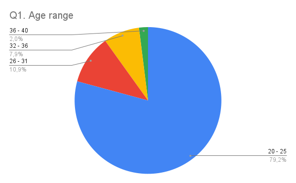

**Q2.** Gender:

**Q3.** Occupation:

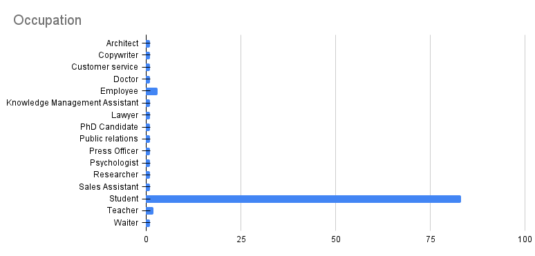

## Section2 - Context of use

**Q4.**  Which device did you use to access the web app?

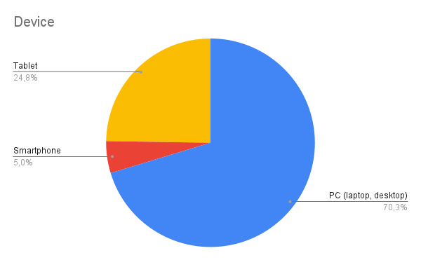

## Section 3 - Interface Design 

**Q5.** How does the interface design look to you?

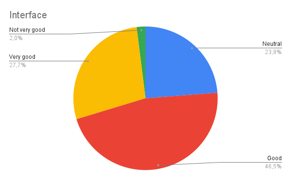

**Q6.** Were the icons and buttons clear?

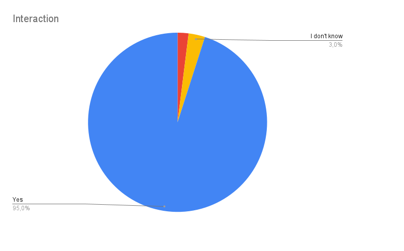

**Q7.** Were the main features easy to find and use?

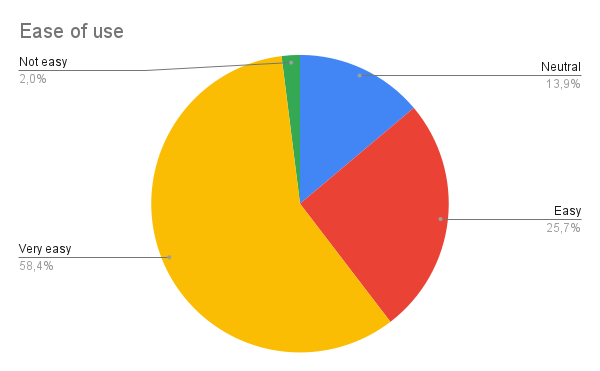

**Q8.** How intuitive was the interaction with the web app?

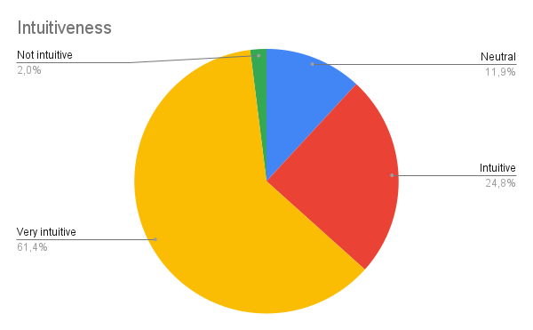

**Q9.** Did you quickly understand how to use the web app?

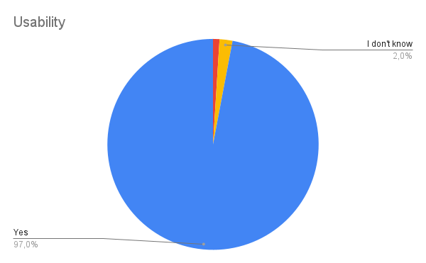

**Q10.** Were the interactions (e.g., clicking buttons or selecting interests) simple?

## Section 5 - Performance & Technical Functioning
**Q11.** How fast were the web app’s response times?

**Q12.** Were there any sections, features, or content that you found unclear?

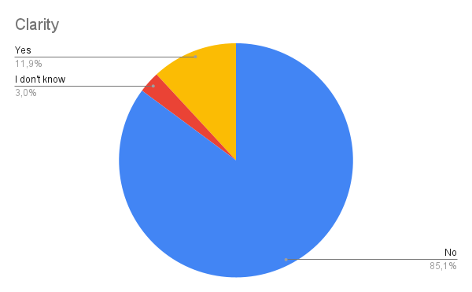

**Q12.1** Please explain which sections, features, or content you found unclear and why.

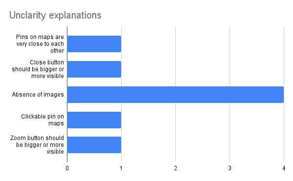

**Q13.** Did you experience any technical problems or malfunctions?

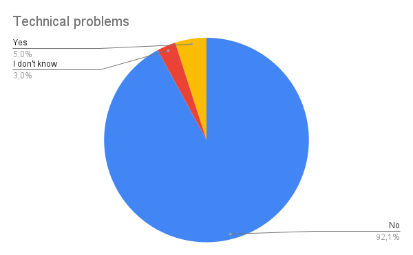

**Q13.1** Please explain which technical problems or malfunctions you experienced.

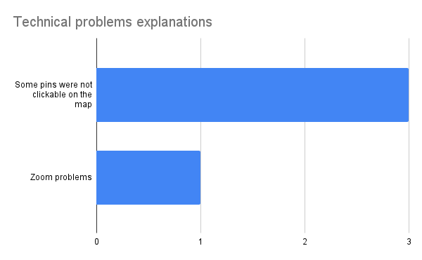

## Section 6 - User Satisfaction & Expectations
**Q14.** To what extent did the web app meet your expectations?

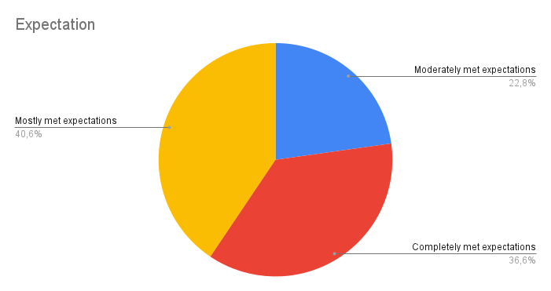

**Q15.** How likely are you to recommend this web app to others?
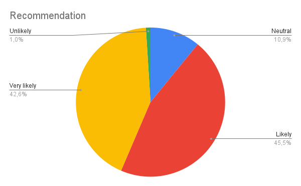

**Q16.** Which features did you find most useful? (You may select more than one option)

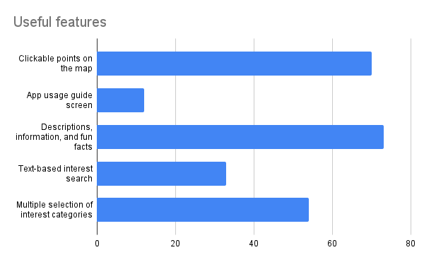

## Section 7 - Suggestions & Improvement

**Q17.** Is there anything you would improve?

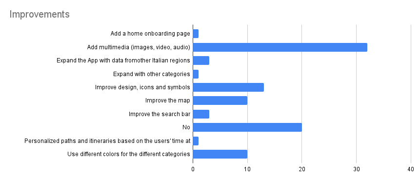
